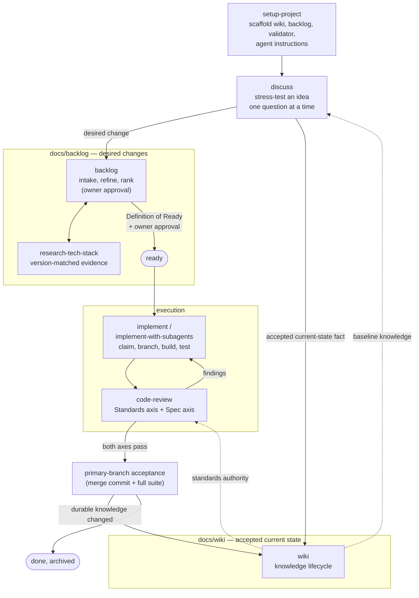

# Beeltec Skills

[](https://skills.sh/beeltec/skills)

14 reusable skills for Codex, Claude Code, Cursor, and other agents that support the [Agent Skills](https://agentskills.io) open standard.

## Install

```bash
npx skills add beeltec/skills
```

Choose skills interactively, or install a specific skill:

```bash
npx skills add beeltec/skills --skill glab
```

Add `--global` to install globally, or `--list` to inspect the catalog without installing.

## Development Workflow Skills

These skills form one connected delivery workflow built on two strictly separated project records: `docs/wiki` owns accepted current state on the primary branch, `docs/backlog` owns approved desired changes and their execution state. A proposal never enters the wiki, and completed work becomes accepted knowledge only after primary-branch acceptance and reconciliation.



1. **setup-project** scaffolds both records, their templates and indexes, `scripts/validate-project.mjs`, and managed agent instructions.
2. **discuss** resolves an idea against accepted knowledge, then routes each conclusion: desired changes to **backlog**, already-current facts to **wiki**.
3. **backlog** captures and refines Epics (`EPIC-NNN`) and work items (`WORK-NNN`) under explicit owner approval; **research-tech-stack** attaches version-matched evidence where readiness needs it. Only approved, ready work is executable.
4. **implement** (single session) or **implement-with-subagents** (one fresh subagent per item) executes ready work: claim, conventional branch, incremental commits, and a **code-review** loop on two independent axes — Standards (wiki and repository rules) and Spec (the work item's desired delta) — until both pass.
5. After merge to the primary branch, durable knowledge changes are reconciled into the **wiki** with owner approval, and the terminal backlog record is archived with its history.

| Skill | Description |
|-------|-------------|
| **setup-project** | Initialize or safely upgrade a project with wiki, backlog, validation, and agent instructions |
| **discuss** | Stress-test an idea one question at a time, then route conclusions to wiki or backlog |
| **wiki** | Manage the lifecycle of accepted project knowledge |
| **backlog** | Manage approved desired work from intake through refinement, ranking, execution, and archival |
| **research-tech-stack** | Attach current, version-matched evidence to a proposed backlog item before readiness |
| **implement** | Execute a ready work item or Epic through claim, implementation, review, and completion |
| **implement-with-subagents** | Orchestrate an Epic or work-item set with one fresh subagent per item |
| **code-review** | Review changes against accepted standards and the work item's scope |

## Standalone Skills

Independent skills that work in any project:

| Skill | Description |
|-------|-------------|
| **bump-version** | Detect patch/minor/major bumps, update version files and changelog, create a release commit |
| **codex-subagent** | Delegate implementation tasks to a workspace-scoped Codex CLI agent |
| **create-conventional-branch** | Create and switch to a branch following the Conventional Branch specification |
| **elementor-content** | Create and edit Elementor JSON or WordPress database content via WP-CLI |
| **glab** | Manage GitLab merge requests, issues, pipelines, releases, and repositories with `glab` |
| **maestro-e2e-testing** | Write, run, and debug Maestro end-to-end tests for mobile apps |

## Manual Installation

Clone the repository and copy or symlink the desired skill directory:

```bash
git clone https://github.com/beeltec/skills.git
cp -RL skills/.agents/skills/glab ~/.codex/skills/glab
```

## Contributing

See [CONTRIBUTING.md](CONTRIBUTING.md) for repository layout and skill authoring guidelines.

## Acknowledgments

The **discuss**, **code-review**, and **implement** skills are customized adaptations of skills created by [Matt Pocock](https://github.com/mattpocock) in [mattpocock/skills](https://github.com/mattpocock/skills) (MIT License).

## License

[MIT](LICENSE)
