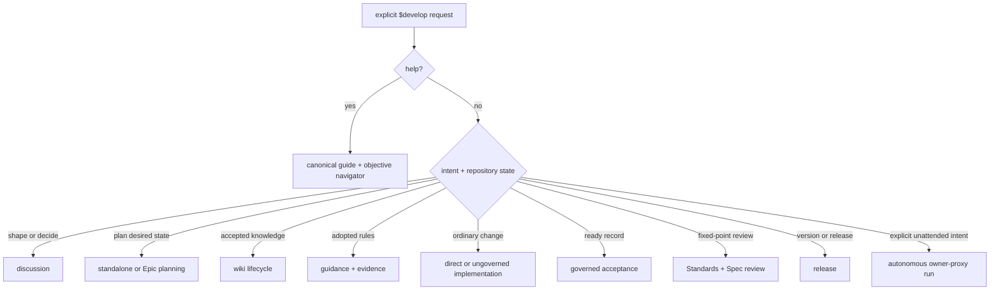

# Beeltec Skills

[](https://skills.sh/beeltec/skills)

Five reusable skills for Codex, Claude Code, Cursor, and other agents supporting the [Agent Skills](https://agentskills.io) open standard.

## Install

```bash
npx skills add beeltec/skills
```

Choose skills interactively, or install one:

```bash
npx skills add beeltec/skills --skill develop
```

Add `--global` to install globally, or `--list` to inspect the catalog without installing.

## Development Gateway

**develop** is the sole development-workflow skill. It activates only when the user explicitly invokes `$develop` (rendered as `/develop` or `/skill:develop` by slash-command clients). Ordinary development requests use the agent's normal behavior and load none of the gateway's procedures.

```text
$develop help
$develop help plan a checkout redesign.
$develop Add CSV export.
$develop discuss whether to replace Redis.
$develop plan checkout v2.
$develop knowledge publish the confirmed cache terminology.
$develop guidance refresh our adopted Redis rules.
$develop implement WORK-014.
$develop review main.
$develop release minor.
$develop product docs/prd/checkout.md.
```

Mode words are optional. `$develop help` shows the canonical interface and asks for the intended outcome; `$develop help <goal>` returns one exact recommended invocation without executing it or inspecting a repository. Otherwise the gateway infers the least burdensome suitable procedure and starts it without a route-confirmation pause:



### Routing Principles

- **Opt-in:** only explicit `$develop`, `/develop`, or harness-equivalent command invocation activates the gateway.
- **Conditional context:** former workflow capabilities are internal procedure files loaded only after routing.
- **Help before preflight:** exact `help` routing reads no project state, performs no mutation, and never executes the recommended request.
- **Adaptive governance:** existing `docs/wiki` and `docs/backlog` inform relevant work but never force every change through records. Setup is never automatic for ordinary implementation.
- **Intent-sensitive branches:** advisory, planning, knowledge, setup, and bounded direct work stay on the current branch by default. Substantial or governed implementation uses one conventional acceptance branch.
- **Explicit autonomy:** only `product`, `unattended`, `autonomous`, or `owner-proxy` language authorizes the gateway to answer owner decisions and carry a run uninterrupted.
- **Proportionate verification:** direct work uses focused checks; governed acceptance adds one Standards/Spec review and one representative suite, expanding matrices only when the changed contract requires it.

### Compatibility And Handoffs

Former commands such as `to-epic`, `to-backlog`, `research <record>`, `to-wiki`, `to-guidance`, `research-tech-stack`, `setup-project`, `implement-with-subagents`, `code-review`, `bump-version`, and `to-product` remain routing aliases. Help teaches only the canonical interface. Transactional planning, research, knowledge, and guidance aliases retain standing approval only for their exact local governed transaction and commit; they never authorize implementation, remote publication, destructive knowledge changes, rule replacement, or unrelated records.

When a terminal outcome has a follow-up, the gateway forms one exact `$develop ...` request with real arguments. A harness with an ask-user-question tool presents it as the recommended option beside a stop option and continues only after selection; other harnesses emit one `Next step: $develop ...` line. The gateway never does both or chains internal procedures as user commands.

### Governed Projects

When a project uses the optional scaffold, `docs/wiki` owns accepted primary-branch state and `docs/backlog` owns desired deltas, proposal evidence, priority, claims, and execution history. The gateway keeps proposals out of the wiki, drafts significant proposed decisions on backlog records, and publishes ADRs only after decisions become current.

`$develop setup` installs or upgrades that scaffold, its validator, and a compact instruction block. It remains optional: repositories without it can use discussion, direct changes, reviews, releases, and substantial ungoverned implementation.

Explicit planning authorizes non-destructive intake and refinement through `ready`, including its coherent local commits, but not implementation. `research <record>` updates and commits proposal evidence without refining or changing record status. Explicit `knowledge` and `guidance` publication authorize their exact additive or refresh wiki transaction and local commit; destructive lifecycle, meaning, or adopted-rule changes still require approval. Wiki and backlog commits default to `docs(wiki):` and `docs(backlog):` unless the repository defines another convention.

Active Epic indexes link each Epic directory, include its outcome, and list every active Epic exactly once. The installed validator rejects malformed, missing, duplicate, or orphaned entries.

### Autonomous Delivery

`$develop product <PRD>` is the explicit unattended lane. It builds an outcome graph, records visible owner-proxy decisions and assumptions, routes each outcome through only the needed procedures, serializes writers, verifies repository evidence, and parks technically impossible outcomes after bounded retries. It never grows the PRD, pushes, opens a PR/MR, or publishes remotely without separate authority.

Read [the gateway evaluation cases](skills/commands/develop/assets/evaluation-cases.md) for activation and execution expectations.

## Skill Catalog

| Skill | Description |
|---|---|
| **develop** | Explicit-invocation-only gateway for discussion, planning, governance, implementation, review, release, and autonomous delivery |
| **codex-subagent** | Delegate coding tasks to a workspace-scoped Codex CLI agent when explicitly requested |
| **elementor-content** | Create and edit Elementor JSON or WordPress database content via WP-CLI |
| **glab** | Manage GitLab merge requests, issues, pipelines, releases, and repositories with `glab` |
| **maestro-e2e-testing** | Write, run, and debug Maestro end-to-end tests for mobile apps |

The four specialized tools remain independently discoverable. They are not development-flow entry points and do not activate `$develop`.

## Manual Installation

Clone the repository and copy or symlink the desired skill directory:

```bash
git clone https://github.com/beeltec/skills.git
cp -RL skills/.agents/skills/develop ~/.codex/skills/develop
```

## Contributing

See [CONTRIBUTING.md](CONTRIBUTING.md) for repository layout, validation, and skill authoring guidance.

## Acknowledgments

The internal discussion, review, and implementation procedures are customized adaptations of skills created by [Matt Pocock](https://github.com/mattpocock) in [mattpocock/skills](https://github.com/mattpocock/skills) (MIT License).

## License

[MIT](LICENSE)
