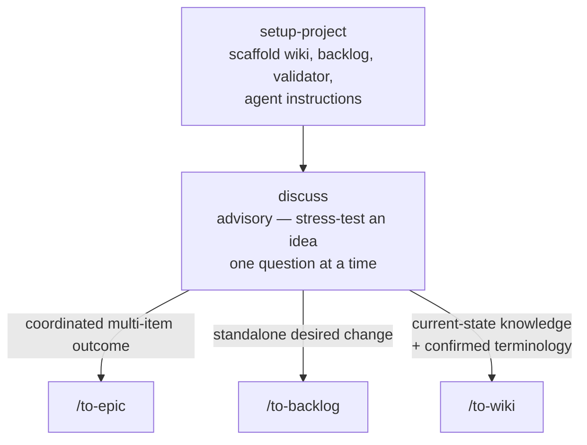
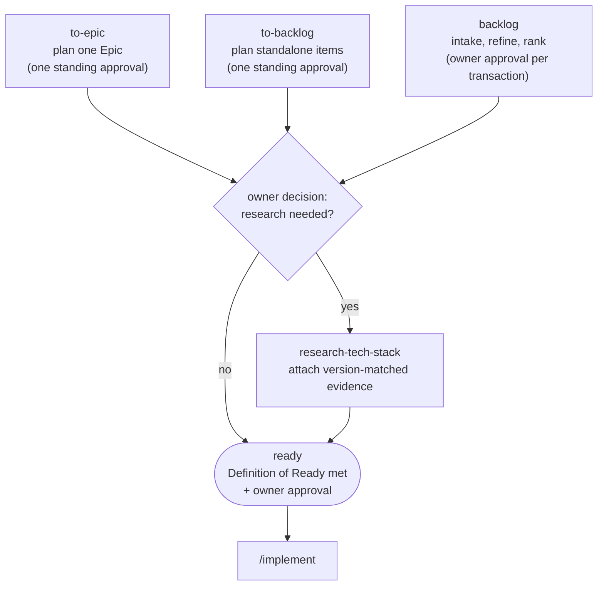
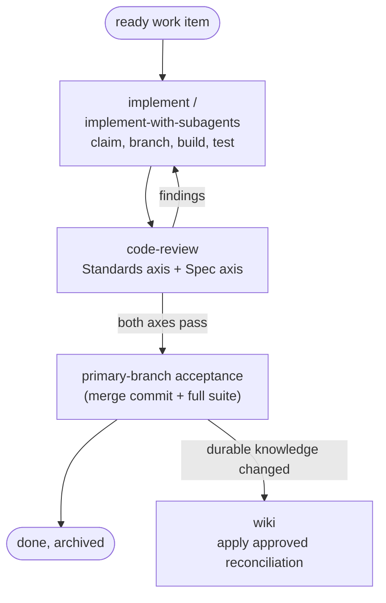
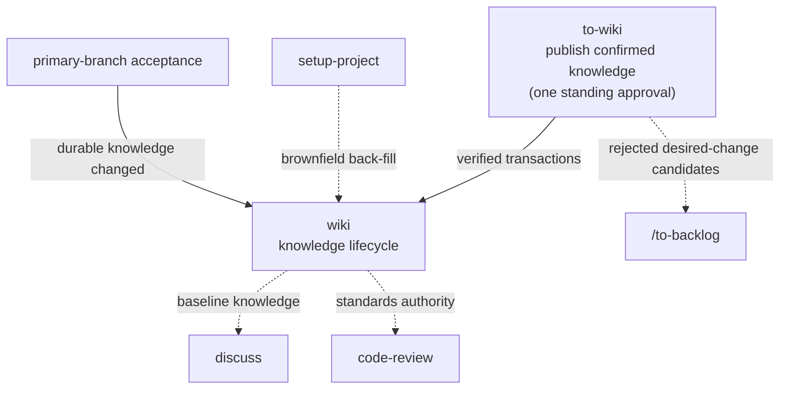

# Beeltec Skills

[](https://skills.sh/beeltec/skills)

17 reusable skills for Codex, Claude Code, Cursor, and other agents that support the [Agent Skills](https://agentskills.io) open standard.

## Install

```bash
npx skills add beeltec/skills
```

Choose skills interactively, or install a specific skill:

```bash
npx skills add beeltec/skills --skill glab
```

Add `--global` to install globally, or `--list` to inspect the catalog without installing.

## Development Workflow Skills

These skills form one connected delivery workflow built on two strictly separated project records: `docs/wiki` owns accepted current state on the primary branch, `docs/backlog` owns approved desired changes and their execution state. A proposal never enters the wiki, and completed work becomes accepted knowledge only after primary-branch acceptance and reconciliation.

### Shape an idea and route it

**discuss** stress-tests an idea against accepted knowledge, then recommends exactly one command per confirmed conclusion:



### Plan desired changes to ready — `docs/backlog`

The planners run the same record mechanics as **backlog**, but under one standing approval each, pausing only for the owner's research decision:



### Execute and accept

Ready work is executed on a conventional branch and reviewed until both axes pass; acceptance happens only on the primary branch:



### Grow accepted knowledge — `docs/wiki`

The wiki is fed from three directions and feeds back into discussion and review:



1. **setup-project** scaffolds both records, their templates and indexes, `scripts/validate-project.mjs`, managed agent instructions, and compatible CI integration. On a brownfield repository it back-fills a foundation wiki from code-verified facts (see below).
2. **discuss** resolves an idea against accepted knowledge, fully advisory — it never mutates records itself. It ends by recommending the matching command: `/to-epic` for a coordinated multi-item outcome, `/to-backlog` for standalone desired changes, `/to-wiki` for conclusions that already describe accepted current state — including confirmed terminology, even when the term arose from an unshipped proposal. A single conversation can route to several; execution always passes through backlog readiness — there is no direct-implementation route.
3. **backlog** owns the record mechanics for Epics (`EPIC-NNN`) and work items (`WORK-NNN`) under per-transaction owner approval; **to-epic** plans one Epic and **to-backlog** plans confirmed standalone items end-to-end to ready under a single standing approval each, pausing only for one explicit owner decision on research; **research-tech-stack** attaches version-matched evidence to a proposed record where readiness needs it. Only approved, ready work is executable.
4. **to-wiki** is the knowledge counterpart of the to-\* planners: it publishes the conversation's confirmed durable knowledge — from discussion or codebase inspection — as validated **wiki** transactions under one standing approval, verifying every claim against repository evidence. It pauses per item for anything destructive (deprecating or deleting a concept), and rejects proposal-shaped candidates back toward `/to-backlog` instead of publishing them.
5. **implement** (single session) or **implement-with-subagents** (one fresh subagent per item) executes ready work: claim, conventional branch, incremental commits with per-subtask evidence, and a **code-review** loop on two independent axes — Standards (wiki and repository rules) and Spec (the work item's desired delta) — until both pass. Wiki changes are only drafted on the work branch, never applied there.
6. Primary-branch acceptance is a merge commit plus the full suite. Only then are durable knowledge changes applied to the **wiki** as the exact owner-approved transaction, and the terminal backlog record is archived with its history. When no ready work remains, the loop closes by recommending `/discuss` on the next open outcome.

Every workflow skill ends its report with a `Next step:` line — one copy-pasteable command with real arguments, chosen from the run's outcome, as the report's last line (a numbered list in run order when several must run) — so each step hands off to the next.

**setup-project**, **discuss**, **to-epic**, **to-backlog**, and **to-wiki** are user-invoked only (`disable-model-invocation: true`): invoking them is itself an owner decision — for the to-\* skills it grants the standing approval — so an agent may recommend the command but never run it on its own.

### Greenfield and Brownfield

- **Greenfield** (new application): run **setup-project** on the empty repository, then shape the product through `/discuss` — desired outcomes flow through `/to-epic` or `/to-backlog` to ready work, and the implement → code-review → acceptance loop grows wiki knowledge as features land.
- **Brownfield** (existing application): run **setup-project** on the existing repository (it upgrades safely and never overwrites project-owned files). When it detects existing application code with an empty wiki, it automatically explores the codebase and back-fills a foundation overview of code-verified facts — stack, architecture, commands, conventions, terminology. Owner-judgment knowledge (intent, rationale, product language) is reported as candidates for `/discuss` and `/to-wiki`. Once the wiki reflects reality, desired changes follow the same delivery loop as greenfield.

Both paths converge on the same cycle; they differ only in whether the wiki starts empty or must first be back-filled from the existing system.

| Skill | Description |
|-------|-------------|
| **setup-project** | Initialize or safely upgrade a project with wiki, backlog, validation, and agent instructions; back-fill a foundation wiki on brownfield repositories |
| **discuss** | Stress-test an idea one question at a time, then recommend `/to-epic`, `/to-backlog`, or `/to-wiki` per conclusion |
| **wiki** | Manage the lifecycle of accepted project knowledge |
| **to-wiki** | Publish the conversation's confirmed durable knowledge to the wiki under one standing approval |
| **backlog** | Manage approved desired work from intake through refinement, ranking, execution, and archival |
| **to-epic** | Plan one Epic end-to-end to ready under one standing approval |
| **to-backlog** | Take the conversation's confirmed standalone work items to ready under one standing approval |
| **research-tech-stack** | Attach current, version-matched evidence to a proposed backlog item before readiness |
| **implement** | Execute a ready work item or Epic through claim, implementation, review, and completion |
| **implement-with-subagents** | Orchestrate an Epic or work-item set with one fresh subagent per item |
| **code-review** | Review changes against accepted standards and the work item's scope |

## Standalone Skills

Independent skills that work in any project:

| Skill | Description |
|-------|-------------|
| **bump-version** | Detect patch/minor/major bumps, update version files and changelog, create a release commit |
| **codex-subagent** | Delegate implementation tasks to a workspace-scoped Codex CLI agent |
| **create-conventional-branch** | Create and switch to a branch following the Conventional Branch specification |
| **elementor-content** | Create and edit Elementor JSON or WordPress database content via WP-CLI |
| **glab** | Manage GitLab merge requests, issues, pipelines, releases, and repositories with `glab` |
| **maestro-e2e-testing** | Write, run, and debug Maestro end-to-end tests for mobile apps |

## Manual Installation

Clone the repository and copy or symlink the desired skill directory:

```bash
git clone https://github.com/beeltec/skills.git
cp -RL skills/.agents/skills/glab ~/.codex/skills/glab
```

## Contributing

See [CONTRIBUTING.md](CONTRIBUTING.md) for repository layout and skill authoring guidelines.

## Acknowledgments

The **discuss**, **code-review**, and **implement** skills are customized adaptations of skills created by [Matt Pocock](https://github.com/mattpocock) in [mattpocock/skills](https://github.com/mattpocock/skills) (MIT License).

## License

[MIT](LICENSE)
