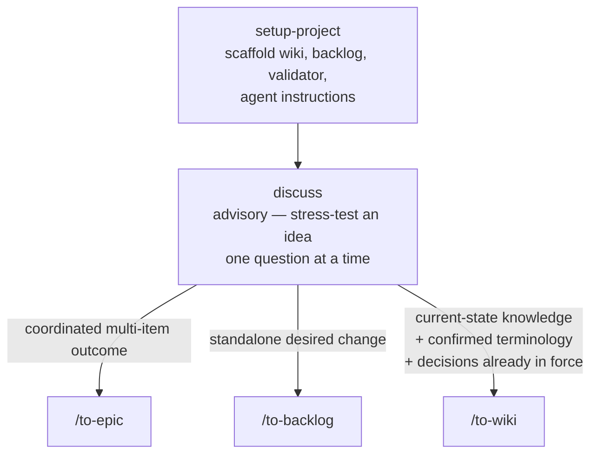
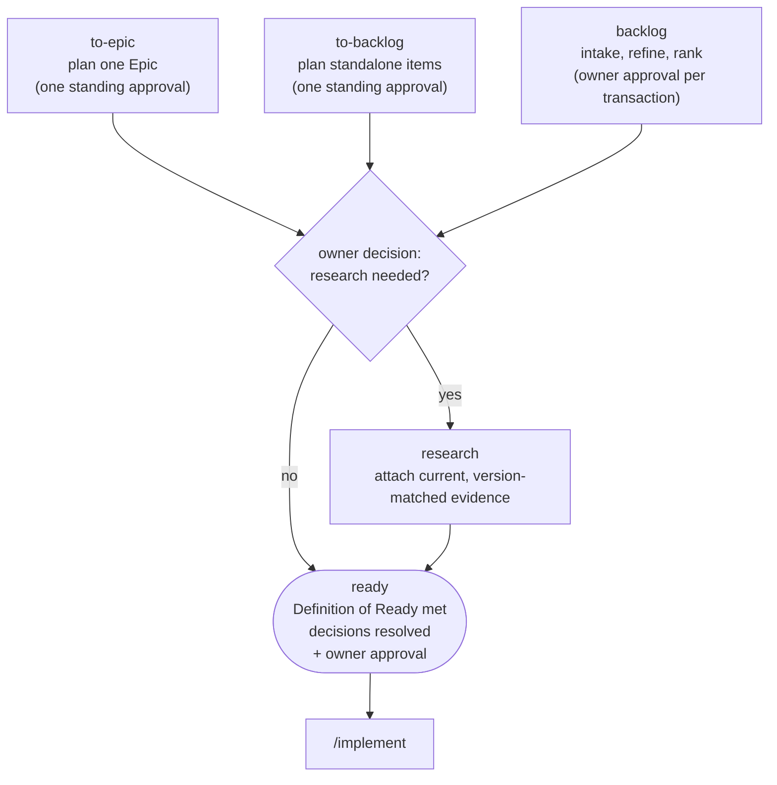
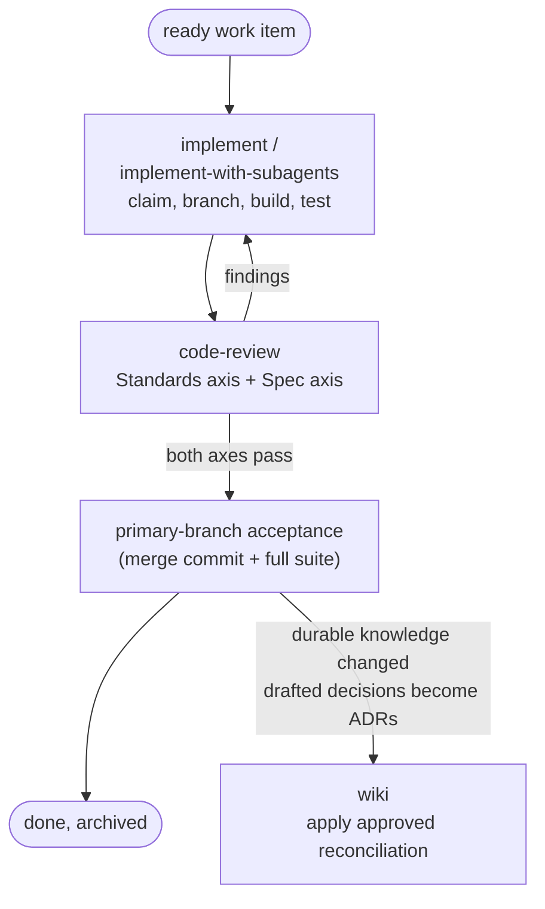
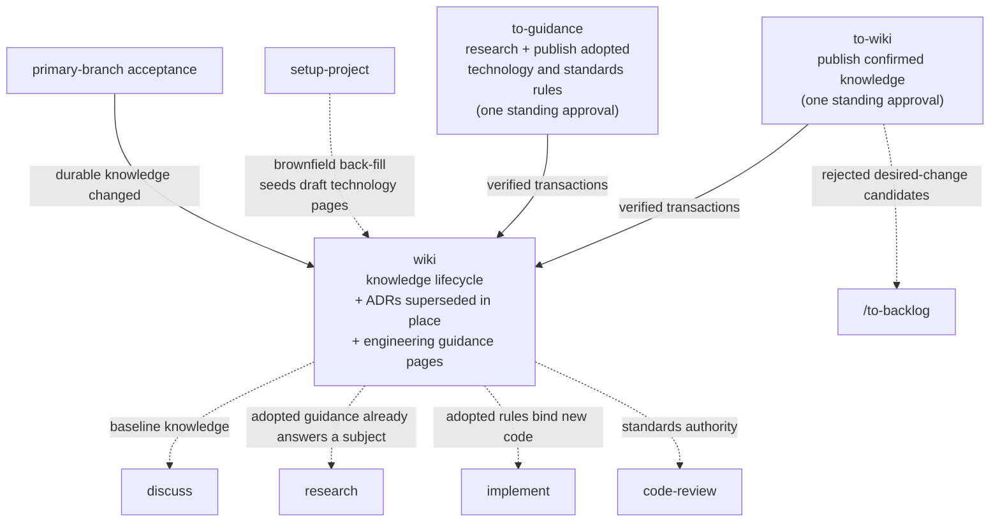

# Beeltec Skills

[](https://skills.sh/beeltec/skills)

18 reusable skills for Codex, Claude Code, Cursor, and other agents that support the [Agent Skills](https://agentskills.io) open standard.

## Install

```bash
npx skills add beeltec/skills
```

Choose skills interactively, or install a specific skill:

```bash
npx skills add beeltec/skills --skill glab
```

Add `--global` to install globally, or `--list` to inspect the catalog without installing.

## Development Workflow Skills

These skills form one connected delivery workflow built on two strictly separated project records: `docs/wiki` owns accepted current state on the primary branch, `docs/backlog` owns approved desired changes and their execution state. A proposal never enters the wiki, and completed work becomes accepted knowledge only after primary-branch acceptance and reconciliation. Architecturally significant decisions are recorded as ADRs under `docs/wiki/architecture/decisions/` — drafted on the backlog record, published only at acceptance, and superseded in place rather than deleted, because a decision stays true even after it stops governing.

### Shape an idea and route it

**discuss** stress-tests an idea against accepted knowledge, then recommends exactly one command per confirmed conclusion:



### Plan desired changes to ready — `docs/backlog`

The planners run the same record mechanics as **backlog**, but under one standing approval each, pausing only for the owner's research decision:



### Execute and accept

Ready work is executed on a conventional branch and reviewed until both axes pass; acceptance happens only on the primary branch:



### Grow accepted knowledge — `docs/wiki`

The wiki is fed from four directions and feeds back into planning, implementation, and review:



**to-guidance** is the answer to re-researching the same stack for every Epic. It resolves each subject's installed version from repository evidence, fans out one sub-agent per subject, and publishes one canonical page per technology (`docs/wiki/engineering/technologies/`) or cross-cutting standard (`docs/wiki/engineering/standards/`). A page separates `Requirements` that bind new code from `Recommendations`, `Conventions`, and recorded `Deviations`, and lists `Known gaps` where existing code contradicts a rule. Invoking it again for the same subject refreshes the page — re-resolving versions and re-verifying claims — and pauses for explicit approval only when a refresh would reverse or remove an already-adopted rule.

Use it when a technology or standard enters the stack, when guidance a `/research` run produced should become durable, and when a page's recorded version no longer matches the manifest. Nothing detects that staleness for you: `/code-review` reports a version-mismatched page as a finding rather than enforcing it, but refreshing is an explicit `/to-guidance` invocation.

A few rules the diagrams don't show: execution always passes through backlog readiness — there is no direct-implementation route — and readiness requires every architecturally significant design choice drafted in ADR shape under `## Decisions`, or explicitly `none`. Wiki changes are only drafted on the work branch, never applied there; at primary-branch acceptance (a merge commit plus the full suite) each drafted decision becomes an ADR with its `ADR-NNN` allocated, and the terminal backlog record is archived. Every workflow skill ends its report with a `Next step:` line — one copy-pasteable command with real arguments as the report's last line — so each step hands off to the next.

**setup-project**, **discuss**, **to-epic**, **to-backlog**, **to-wiki**, and **to-guidance** are user-invoked only (`disable-model-invocation: true`): invoking them is itself an owner decision — for the to-\* skills it grants the standing approval — so an agent may recommend the command but never run it on its own.

### Greenfield and Brownfield

- **Greenfield** (new application): run **setup-project** on the empty repository, then shape the product through `/discuss` — desired outcomes flow through `/to-epic` or `/to-backlog` to ready work, and the implement → code-review → acceptance loop grows wiki knowledge as features land.
- **Brownfield** (existing application): run **setup-project** on the existing repository (it upgrades safely and never overwrites project-owned files). On existing code with an empty wiki it back-fills a foundation overview of code-verified facts — stack, architecture, commands, conventions, terminology — and reports owner-judgment knowledge (intent, rationale, product language) as candidates for `/discuss` and `/to-wiki`. From there, desired changes follow the same delivery loop as greenfield.

| Skill | Description |
|-------|-------------|
| **setup-project** | Initialize or safely upgrade a project with wiki, backlog, validation, and agent instructions; back-fill a foundation wiki on brownfield repositories |
| **discuss** | Stress-test an idea one question at a time, then recommend `/to-epic`, `/to-backlog`, or `/to-wiki` per conclusion |
| **wiki** | Manage the lifecycle of accepted project knowledge, including ADRs and their supersession |
| **to-wiki** | Publish the conversation's confirmed durable knowledge, including ADRs for decisions in force, under one standing approval |
| **backlog** | Manage approved desired work from intake through refinement, ranking, execution, and archival |
| **to-epic** | Plan one Epic end-to-end to ready under one standing approval |
| **to-backlog** | Take the conversation's confirmed standalone work items to ready under one standing approval |
| **research** | Attach current version and guideline evidence to a proposed backlog item before readiness, fanned out per subject |
| **to-guidance** | Publish and refresh canonical technology and standards guidance under one standing approval, so adopted rules are read instead of re-researched |
| **implement** | Execute a ready work item or Epic through claim, implementation, review, and completion |
| **implement-with-subagents** | Orchestrate an Epic or work-item set with one fresh subagent per item |
| **code-review** | Review changes against accepted standards, unrecorded architectural decisions, and the work item's scope |

## Standalone Skills

Independent skills that work in any project:

| Skill | Description |
|-------|-------------|
| **bump-version** | Detect patch/minor/major bumps, update version files and changelog, create a release commit |
| **codex-subagent** | Delegate implementation tasks to a workspace-scoped Codex CLI agent |
| **create-conventional-branch** | Create and switch to a branch following the Conventional Branch specification |
| **elementor-content** | Create and edit Elementor JSON or WordPress database content via WP-CLI |
| **glab** | Manage GitLab merge requests, issues, pipelines, releases, and repositories with `glab` |
| **maestro-e2e-testing** | Write, run, and debug Maestro end-to-end tests for mobile apps |

## Manual Installation

Clone the repository and copy or symlink the desired skill directory:

```bash
git clone https://github.com/beeltec/skills.git
cp -RL skills/.agents/skills/glab ~/.codex/skills/glab
```

## Contributing

See [CONTRIBUTING.md](CONTRIBUTING.md) for repository layout and skill authoring guidelines.

## Acknowledgments

The **discuss**, **code-review**, and **implement** skills are customized adaptations of skills created by [Matt Pocock](https://github.com/mattpocock) in [mattpocock/skills](https://github.com/mattpocock/skills) (MIT License).

## License

[MIT](LICENSE)
