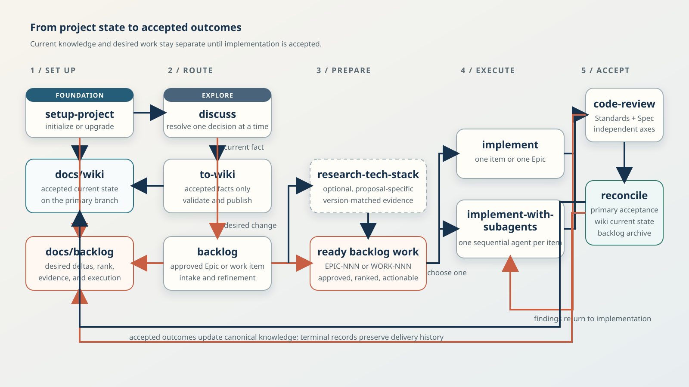

# Beeltec Skills

[](https://skills.sh/beeltec/skills)

A collection of 14 reusable skills for Codex, Claude Code, Cursor, and other agents that support the [Agent Skills](https://agentskills.io) open standard.

## Install

```bash
npx skills add beeltec/skills
```

Choose skills interactively, or install a specific skill:

```bash
npx skills add beeltec/skills --skill glab
npx skills add beeltec/skills --skill elementor-content
```

Install globally with `--global`, or inspect the catalog without installing:

```bash
npx skills add beeltec/skills --global
npx skills add beeltec/skills --list
```

## Available Skills

| Skill | Description |
|-------|-------------|
| **backlog** | Manage approved desired work from lightweight intake through refinement, ranking, execution state, cancellation, and archival |
| **bump-version** | Versioning workflow — detect patch/minor/major bumps, update version files and changelog, then create a release commit |
| **code-review** | Review backlog-backed changes independently against accepted standards and the selected work item's scope |
| **codex-subagent** | From non-Codex harnesses such as Claude Code or OpenCode only, delegate implementation tasks to a workspace-scoped Codex CLI agent with configurable model and reasoning effort; never invoke from Codex itself |
| **create-conventional-branch** | Create and switch to a purpose-driven branch that follows the Conventional Branch specification |
| **discuss** | Stress-test an idea one question at a time, then route accepted facts to the wiki and desired changes to the backlog |
| **elementor-content** | Create and edit Elementor JSON or WordPress database content via WP-CLI |
| **glab** | Manage GitLab merge requests, issues, pipelines, releases, and repositories with `glab` |
| **implement** | Execute a ready work item or Epic through claim, implementation, review, acceptance, completion, and archival |
| **implement-with-subagents** | Orchestrate an Epic or explicit work-item set through one fresh sequential subagent per item |
| **maestro-e2e-testing** | Write, run, and debug Maestro end-to-end tests for mobile apps |
| **research-tech-stack** | Resolve version-specific uncertainty for proposed backlog work and attach the evidence before readiness |
| **setup-project** | Initialize or safely upgrade a project with accepted-state wiki, desired-change backlog, validation, and agent instructions |
| **wiki** | Manage the complete lifecycle of accepted project knowledge, from discovery and evidence through correction, organization, deprecation, and deletion |

## Development Workflow

The development skills maintain two distinct project records throughout delivery:

- `docs/wiki` owns durable knowledge that describes accepted current state on the primary branch.
- `docs/backlog` owns proposed desired deltas, approval, priority, research, execution state, and history.

Work moves from current-state context to an approved desired delta, through implementation and two-axis review, then back into accepted knowledge and archived history. The records remain separate so an agreed proposal is never mistaken for implemented project state.



### 1. Establish project state

Run **setup-project** once to initialize or safely upgrade the governed wiki and backlog, their templates and indexes, the consolidated project validator, and managed agent instructions. Existing project-owned content and customized integrations are preserved for explicit reconciliation.

The generated `node scripts/validate-project.mjs` command validates both systems while preserving their separate authority.

### 2. Explore and route knowledge

Use **discuss** to examine an idea against accepted project knowledge and resolve decisions one question at a time. Its handoff depends on what the conclusion represents:

- Send a new capability, behavior change, fix, or migration to **backlog** as proposed desired work.
- Send a correction or durable conclusion that already describes accepted current state to **wiki**.
- Split mixed conclusions between the two without copying an unimplemented target into the wiki.

These are state-aware routes, not a mandatory sequence. **wiki** owns all accepted-knowledge reads and lifecycle operations, verifies evidence, obtains exact semantic approval, validates, and commits coherent wiki transactions. **backlog** obtains explicit owner approval for durable intent and priority transactions.

### 3. Prepare desired work

Use **backlog** to capture and refine an `EPIC-NNN` or `WORK-NNN`, maintain relationships and global rank, and verify its Definition of Ready. Standalone work remains first-class; an Epic is used only for a genuine coordinated outcome.

Invoke **research-tech-stack** only for an identified proposed Epic or work item whose technical readiness needs current, version-matched evidence. Proposal-specific sources, recommendations, deviations, and uncertainty stay on that backlog record. **backlog** owns the separately approved transition to `ready` after research and all other readiness gates pass.

### 4. Choose an implementation path

Execute ready work through one of two alternative paths:

- **implement** executes one work item or every actionable child of one Epic in the current agent session.
- **implement-with-subagents** orchestrates an explicit Epic or work-item set, assigning each item to exactly one fresh subagent in rank and dependency order.

Both paths enforce claims, focused and full tests, incremental commits, two-axis **code-review**, wiki reconciliation, primary-branch acceptance, completion, and archival. Review findings return to implementation until both Standards and Spec pass. The Standards axis uses accepted wiki and repository rules; the Spec axis uses the selected work item's desired delta and acceptance criteria in its Epic context.

After primary-branch acceptance, completed outcomes that changed durable current state are reconciled into their canonical wiki concepts with owner approval. Terminal backlog records retain proposal and execution history in the appropriate archive.

### Implementing with subagents

Use **implement-with-subagents** when isolated context per work item is useful and the authorized scope is explicit:

1. Identify one ready Epic, an explicit non-empty set of work-item IDs, or their backlog record paths.
2. Start a fresh session when planning context would compete with orchestration context.
3. Invoke **implement-with-subagents** with the authorized scope and optional model settings:

```text
Use $implement-with-subagents with EPIC-012.
Use $implement-with-subagents for WORK-014, WORK-019, and docs/backlog/standalone/WORK-023-fix-export.md.
```

The orchestrator reloads the authoritative global rank after every completion and delegates only actionable authorized work. It runs one subagent at a time and independently verifies every direct implementation gate before continuing.

## Manual Installation

If you prefer not to use the CLI, clone the repository and copy or symlink the desired directory:

```bash
git clone https://github.com/beeltec/skills.git
cp -RL skills/.agents/skills/glab ~/.codex/skills/glab
```

## Maintaining the Repository

Keep canonical skill directories categorized under `skills/`. Expose each skill through a relative symlink in the cross-client `.agents/skills/` directory:

```text
skills/
├── planning/
├── tools/
├── utilities/
└── workflows/

skills/<category>/<skill-name>/
├── SKILL.md            # Required metadata and core instructions
├── agents/             # Optional client-specific UI metadata
├── scripts/            # Optional executable helpers
├── references/         # Optional documentation loaded on demand
└── assets/             # Optional templates and static resources

.agents/skills/<skill-name> -> ../../skills/<category>/<skill-name>
```

For each change:

1. Choose the narrowest existing category; add a category only when several related skills need it.
2. Keep the canonical directory name, symlink name, and frontmatter `name` identical and lowercase with hyphens.
3. Create symlinks relative to `.agents/skills/` so they remain valid in every clone.
4. Make `description` explain both capability and activation context.
5. Keep `SKILL.md` focused and under 500 lines; move conditional detail into directly linked resource files.
6. Confirm skills.sh discovery before publishing:

   ```bash
   npx skills add . --list
   ```

See the [Agent Skills specification](https://agentskills.io/specification), [creator best practices](https://agentskills.io/skill-creation/best-practices), and [skills CLI documentation](https://github.com/vercel-labs/skills#readme).

## Acknowledgments

The **discuss**, **code-review**, and **implement** skills are customized adaptations of skills created by [Matt Pocock](https://github.com/mattpocock) in [mattpocock/skills](https://github.com/mattpocock/skills), which is licensed under the MIT License. Thanks to Matt for creating and sharing the originals.

## License

[MIT](LICENSE)
