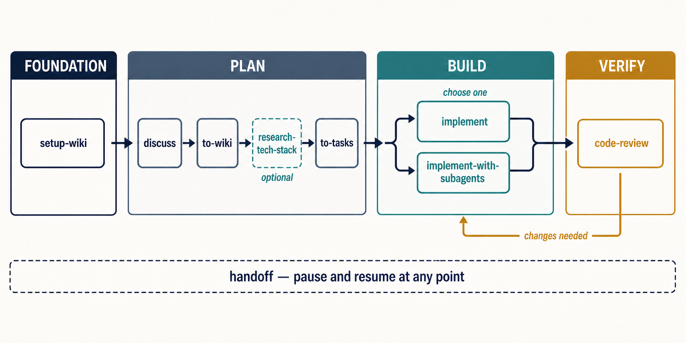

# Beeltec Skills

[](https://skills.sh/beeltec/skills)

A collection of 15 reusable skills for Codex, Claude Code, Cursor, and other agents that support the [Agent Skills](https://agentskills.io) open standard.

## Install

```bash
npx skills add beeltec/skills
```

Choose skills interactively, or install a specific skill:

```bash
npx skills add beeltec/skills --skill glab
npx skills add beeltec/skills --skill elementor-content
```

Install globally with `--global`, or inspect the catalog without installing:

```bash
npx skills add beeltec/skills --global
npx skills add beeltec/skills --list
```

## Available Skills

| Skill | Description |
|-------|-------------|
| **bump-version** | Versioning workflow — detect patch/minor/major bumps, update version files and changelog, then create a release commit |
| **code-review** | Review changes in parallel against repository standards and their originating specification |
| **codex-subagent** | From non-Codex harnesses such as Claude Code or OpenCode only, delegate implementation tasks to a workspace-scoped Codex CLI agent with configurable model and reasoning effort; never invoke from Codex itself |
| **create-conventional-branch** | Create and switch to a purpose-driven branch that follows the Conventional Branch specification |
| **discuss** | Stress-test a plan or decision through a guided, one-question-at-a-time discussion |
| **elementor-content** | Create and edit Elementor JSON or WordPress database content via WP-CLI |
| **glab** | Manage GitLab merge requests, issues, pipelines, releases, and repositories with `glab` |
| **implement** | Execute an existing task plan with branching, commits, tests, and review |
| **implement-with-subagents** | Execute a `$to-tasks` plan through one sequential subagent per task |
| **maestro-e2e-testing** | Write, run, and debug Maestro end-to-end tests for mobile apps |
| **research-tech-stack** | Research current, version-matched technology guidance and persist it in the engineering wiki before implementation |
| **setup-wiki** | Scaffold an Open Knowledge Format 0.1 project wiki with agreed domain terminology, validation, and agent instructions |
| **to-tasks** | Convert a conversation or specification into linked implementation tasks |
| **to-wiki** | Turn confirmed conclusions into durable, canonical project wiki knowledge |

## Development Workflow

The development skills form a connected path from an early idea to reviewed code. Each phase produces durable context for the next one, so agents do not have to reconstruct decisions, requirements, or technical constraints later.



### 1. Establish the project foundation

Start each project with **setup-wiki**. It creates the shared wiki structure, validation tooling, and agent instructions used throughout the rest of the workflow. This is a one-time project setup, not a step that must be repeated for every feature.

### 2. Turn an idea into an implementation plan

Use the planning skills in sequence:

1. **discuss** explores the idea, challenges assumptions, and clarifies requirements and tradeoffs.
2. **to-wiki** records the confirmed conclusions as durable project knowledge.
3. **research-tech-stack** is optional. Use it when implementation depends on current, version-specific guidance that is not already documented in the project wiki.
4. **to-tasks** converts the agreed specification and relevant technical guidance into bounded, linked tasks with an explicit execution order.

By the end of this phase, the project wiki explains what was decided and why, while the task documents explain what needs to be built.

### 3. Choose an implementation path

Execute the task plan with one of two skills:

- **implement** handles the plan in the current agent session, including branching, incremental commits, tests, documentation lookup, and review.
- **implement-with-subagents** delegates each task to a fresh subagent in dependency order. Use it for a plan created by **to-tasks** when isolating task context is valuable.

These are alternative execution paths, not consecutive steps.

### 4. Verify the result

Run **code-review** after implementation. It checks the changes independently along two axes: compliance with the repository's documented standards and fidelity to the originating specification. If the review finds problems, return to the implementation phase, address them, and review again.

### Implementing with subagents

Use **implement-with-subagents** after the planning phase has produced a complete
task set. Once **to-tasks** has created the task documents:

1. Note the path to the generated master document, usually
   `docs/tasks/<feature-slug>/000-overview.md`.
2. Clear the current session and start a fresh one so implementation does not
   compete with the planning conversation for context.
3. Select a small model for the orchestrator, such as GPT 5.4 Mini or Sonnet 5.
4. Invoke **implement-with-subagents** and point it at the master document:

   ```text
   Use $implement-with-subagents with docs/tasks/<feature-slug>/000-overview.md
   ```

The orchestrator reads the master plan and delegates each task to a separate
subagent, running only one subagent at a time in dependency order.

## Manual Installation

If you prefer not to use the CLI, clone the repository and copy or symlink the desired directory:

```bash
git clone https://github.com/beeltec/skills.git
cp -RL skills/.agents/skills/glab ~/.codex/skills/glab
```

## Maintaining the Repository

Keep canonical skill directories categorized under `skills/`. Expose each skill through a relative symlink in the cross-client `.agents/skills/` directory:

```text
skills/
├── planning/
├── tools/
├── utilities/
└── workflows/

skills/<category>/<skill-name>/
├── SKILL.md            # Required metadata and core instructions
├── agents/             # Optional client-specific UI metadata
├── scripts/            # Optional executable helpers
├── references/         # Optional documentation loaded on demand
└── assets/             # Optional templates and static resources

.agents/skills/<skill-name> -> ../../skills/<category>/<skill-name>
```

For each change:

1. Choose the narrowest existing category; add a category only when several related skills need it.
2. Keep the canonical directory name, symlink name, and frontmatter `name` identical and lowercase with hyphens.
3. Create symlinks relative to `.agents/skills/` so they remain valid in every clone.
4. Make `description` explain both capability and activation context.
5. Keep `SKILL.md` focused and under 500 lines; move conditional detail into directly linked resource files.
6. Confirm skills.sh discovery before publishing:

   ```bash
   npx skills add . --list
   ```

See the [Agent Skills specification](https://agentskills.io/specification), [creator best practices](https://agentskills.io/skill-creation/best-practices), and [skills CLI documentation](https://github.com/vercel-labs/skills#readme).

## Acknowledgments

The **discuss**, **code-review**, and **implement** skills are customized adaptations of skills created by [Matt Pocock](https://github.com/mattpocock) in [mattpocock/skills](https://github.com/mattpocock/skills), which is licensed under the MIT License. Thanks to Matt for creating and sharing the originals.

## License

[MIT](LICENSE)
