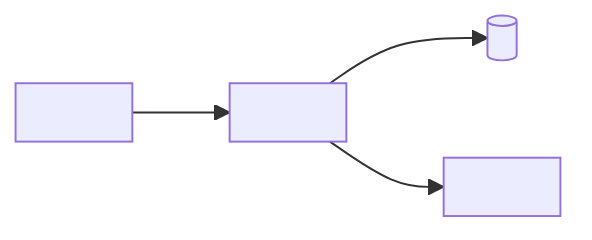

# Overview

Describe what the system does and how it is shaped, in a few paragraphs.
Record the structure that exists today, not the structure that is planned.

Planned changes belong in an [ADR](/adrs/index.md).

# Components

| Component | Responsibility | Location |
|-----------|----------------|----------|
| `<component>` | <What it owns> | `<path/in/repo>` |
| `<component>` | <What it owns> | `<path/in/repo>` |

# Boundaries

## <Boundary or module name>

**Owns:** <Data, behaviour, or domain concepts inside the boundary.>

**Exposes:** <The public surface other components may use.>

**Hides:** <Internals no other component may reach into.>

**Talks to:** [<Component>](#components), [<External system>](/external-systems/<system>.md)

# Dependency Rules

* `<layer or module>` may depend on `<layer or module>`.
* `<layer or module>` must not depend on `<layer or module>`.
* Dependencies point <inward / toward the domain / in one direction only>.
* <Rule about shared code, cycles, or framework leakage.>

# Data Flow

Describe the path a typical request or message takes through the components.

1. <Step>
2. <Step>
3. <Step>

# Diagram

# Related

* [Ubiquitous Language](/ubiquitous-language.md)
* [Architecture Decisions](/adrs/index.md)
* [External Systems](/external-systems/index.md)
* [Technology Stack](/technology/index.md)
